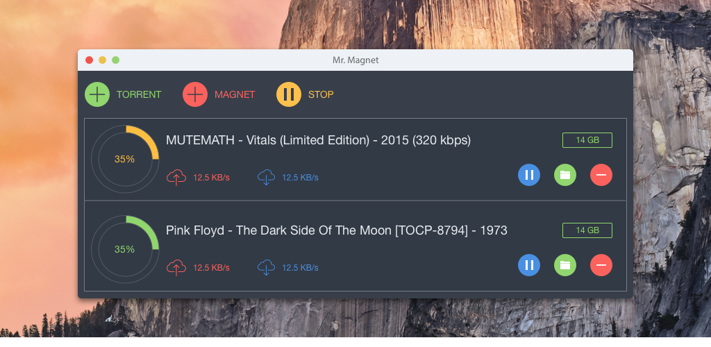

# Mr. Magnet
Yet another torrent client for Windows, Mac and Linux



## Installation
```JavaScript
npm i
```

## Usage
```JavaScript
npm start
```

## Contributing

1. Fork it!
2. Create your feature branch: `git checkout -b my-new-feature`
3. Commit your changes: `git commit -am 'Add some feature'`
4. Push to the branch: `git push origin my-new-feature`
5. Submit a pull request :D

## History

TODO: Write history

## Credits

TODO: Write credits

## License

MIT © [Valery Lyatsevich](http://lyatsevich.com)
