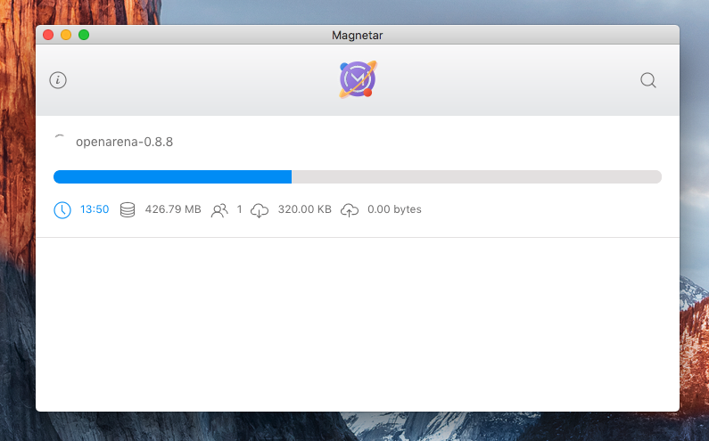

<h1 align="center">
  <br>
  
  <br>
  Magnetar
  <br>
  <br>
</h1>

<h4 align="center">⚡️ Yet another torrent client for Windows, Mac and Linux</h4>


<p align="center">
  
</p>

<h3 align="center">
  <br/>
  <span>Download</span>
  <br/>
  <br/>
</h3>

<h4 align="center">
  <a href="https://github.com/laverix/magnetar/raw/master/release-builds/Magnetar.dmg">Mac OS X</a>
  <br/>
</h4>

<h4 align="center">
  <a href="https://github.com/laverix/magnetar/raw/master/release-builds/magnetar_1.0.0_amd64.deb">Ubuntu</a>
  <br/>
  <br/>
</h4>

## Installation

Please read the [prerequisites](#prerequisites)

```bash
npm install -g @angular/cli
```

```bash
npm i
```

## Usage

Run in development mode:

```bash
npm run electron
```

## Contributing

1. Fork it
2. Create your feature branch: `git checkout -b my-new-feature`
3. Commit your changes: `git commit -am 'Add some feature'`
4. Push to the branch: `git push origin my-new-feature`
5. Submit a pull request

## Prerequisites

Project have dependencies that require Node 6.9.0 or higher, together with NPM 3 or higher.

## History

TODO: Write history

## Credits

TODO: Write credits

## License

MIT © [Valery Lyatsevich](http://lyatsevich.com)
